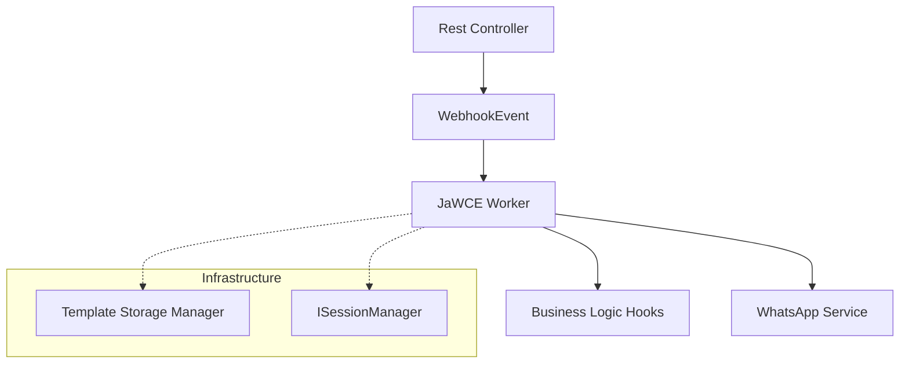

# JaWCE: Java WhatsApp ChatBot Engine

[](https://search.maven.org/artifact/zw.co.dcl.jawce/jengine)
[](https://opensource.org/licenses/MIT)

An enterprise-grade, Spring Boot-native framework for building robust WhatsApp chatbots. JaWCE brings the template-driven power of the WCE ecosystem to the Java world, leveraging Spring's dependency injection and event-driven architecture for industrial-scale deployments.

## 🏗️ Architecture

JaWCE is built for high-performance and modularity, using Spring's `ApplicationEventPublisher` to decouple webhook reception from processing logic.



### Key Technical Features
- **Event-Driven Core**: Incoming payloads are published as `WebhookEvent` and processed by the `Worker`.
- **Dual Hook Support**: Choose between decoupled **Named Hooks** and direct **Reflective Dotted Hooks**.
- **Template Portability**: Fully compatible with WCE YAML/JSON templates used in PyWCE.
- **Enterprise Standards**: Interface-based design for custom session storage (file, database, or Redis) and template management.

---

## 🛠️ Installation (Maven)

Add the engine dependency to your `pom.xml`:

```xml
<dependency>
    <groupId>zw.co.dcl.jawce</groupId>
    <artifactId>jengine</artifactId>
    <version>${jawce.version}</version>
</dependency>
```

---

## 🚦 Business Logic Hooks

JaWCE provides two professional ways to integrate your business logic:

Hook intent in the engine is split clearly:
- `on-receive`: post-input business logic
- `middleware`: cross-cutting logic
- `router`: next-stage redirect logic
- `on-generate`: pre-render preparation
- `template`: render/body shaping
- `dynamic`: backend-driven next message/template selection

### 1. Named Hooks (Decoupled)
Define a name in your YAML template and map it to a Spring component using the `@NamedFlowHook` annotation. This is the recommended approach for clean separation.

**Template (`bot.yaml`):**
```yaml
"CONFIRM-STAGE":
  type: button
  on-receive: "captureResponse"
  message:
    body: "Press to confirm"
```

**Java Hook:**
```java
@Service
public class MyBotHooks {
    @NamedFlowHook(value = "captureResponse", type = FlowHookType.RECEIVE)
    public Hook handle(Hook arg) {
        log.info("Processing: {}", arg.getUserInput());
        return arg;
    }
}
```

### 2. Reflective Dotted Hooks (Direct)
Reference the full class path and method name directly in the template. Useful for quick integrations or when hooks are spread across different modules.

**Template (`bot.yaml`):**
```yaml
"PROFILE-STAGE":
  type: text
  template: "com.myapp.service.UserService.fetchProfile"
```

---

## 🚀 Quick Start Example

A complete implementation requires a Spring controller to feed the engine:

```java
@RestController
public class WebhookController {
    private final ApplicationEventPublisher eventPublisher;

    @PostMapping("/webhook")
    public String handle(@RequestBody Map<String, Object> payload) {
        eventPublisher.publishEvent(new WebhookEvent(this, payload));
        return "ACK";
    }
}
```

---

## 🧪 Real-World Examples
Check the `example/` folder for production-ready implementations:
- **[eHailing Bot](./example/ehailing)**: Demonstrates location requests, named hooks, and complex conversational flows.
- **[Live Support](./example/live-support)**: Shows hybrid AI + Live Agent handoff and WebSocket integration.

---

## 📚 Resources
- [Official Documentation](https://docs.page/donnc/wce)
- [WCE Emulator](https://github.com/DonnC/wce-emulator) (Recommended for local testing)
- [Recovery Semantics](./docs/recovery-semantics.md)
- [Core Engine Strategy](./docs/core-engine-strategy.md)
- [Internal State Model](./docs/internal-state-model.md)
- [Dynamic Choice Model](./docs/dynamic-choice-model.md)
- [Dynamic Rendering](./docs/dynamic-rendering.md)
- [Advanced Dynamic Template Handling](./docs/advanced-dynamic-template-handling.md)

---

## 🤝 Contributing & License
Contributions are welcome! See [CONTRIBUTING.md](./CONTRIBUTING.md).
Project licensed under the [MIT License](./LICENSE).
