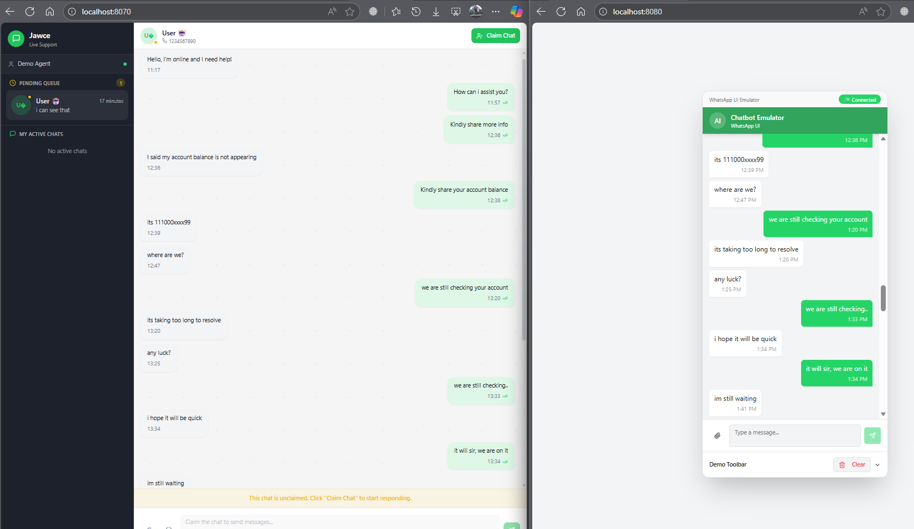

# jawce - WhatsApp Live Support Dashboard

A real-time live support agent dashboard for handling WhatsApp customer conversations.



## Architecture Overview

```
┌─────────────────┐     WebSocket      ┌──────────────────┐     WhatsApp API    ┌─────────────┐
│  React Frontend │◄──────────────────►│  Spring Boot     │◄───────────────────►│  WhatsApp   │
│  (Agent UI)     │                    │  Backend         │                     │  Business   │
└─────────────────┘                    └──────────────────┘                     └─────────────┘
                                              │
                                              ▼
                                       ┌──────────────┐
                                       │  Database    │
                                       │  (Chats,     │
                                       │   Messages)  │
                                       └──────────────┘
```

---

## Development Tips

1. **CORS**: Ensure your Spring Boot allows WebSocket connections from `localhost:8080` (or your Vite dev server port)

2. **Testing**: Use browser DevTools Network tab → WS to monitor WebSocket messages

3. **Reconnection**: The frontend automatically reconnects if the WebSocket disconnects

4. **Console Logs**: Check browser console for `📤 Sending:` and `📥 Received:` logs

---

## Tech Stack

- **Frontend**: React, TypeScript, Tailwind CSS, shadcn/ui
- **Backend**: Spring Boot, WebSocket
- **Communication**: JSON over WebSocket

## Quick Start (Demo Mode)

```bash
npm install
npm run dev
```

